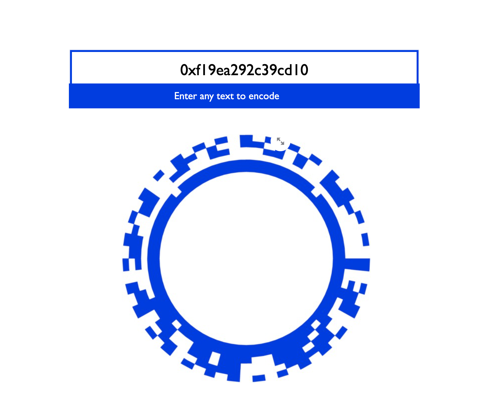

# Ring-Code App



# Ring Code

Introducing a new circular-shaped design for barcode and QRCode! Beyond its aesthetic, the Ring code is adapted to tor geometry. It is also a real challenge of implementation.

# Features

## App

You can use the Streamlit app to generate your own RingCode encoded messages! Please note that the decoding module is still under development.

## Setup

```
python3 -m venv venv && source venv/bin/activate
pip install -r requirements.txt
streamlit run app.py
```

## Usage

You can play with 3 hyperparameters to change the data capacity and the shape of the barcode, in `src/encoder.py`:
- `module_size_pixel`: the size of each tile (aka module)
- `min_radius_pixels`: the size of the inner band of the ring, in pixel
- `max_radius_pixels`: the size of the outer band of the ring, in pixel

## Roadmap

The development of this RingCode follow the [thesis of Robin Brügger](https://www.dropbox.com/s/a62q4lotoyonnv7/P6_2015_Circular_Codes.pdf?dl=0), so hat tips to him for this impressive work.

[x] Encoding <br>
[x] Simple Streamlit App to display the encoding <br>
[ ] Decoding <br>
- [x] Barcode recognition (finding the center)
- [ ] Find the perspective correction markers and startmarker
- [ ] Rough perspective correction
- [ ] Accurate perspective correction
- [ ] Read vertical timing information
- [ ] Evaluation of the payload modules
<br>
[ ] Encoding data using Reed Solomon algorithm

